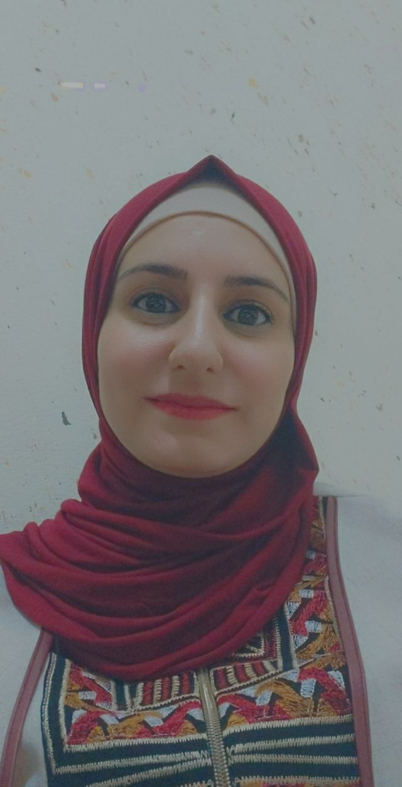

# html-css-task
### Hi there 👋, My Name is Duaa Alsafasfeh
#### I am Trainee in orange coding academy
I graduated from Tafila Technical University in communication and Electronics Engineering

Skills:  HTML / CSS /

- 🌱 I’m currently learning Full stack web development 
- 📫 How to reach me: By E-mail :Dua.alsafasfeh@gmai.com 

        

  

  
()